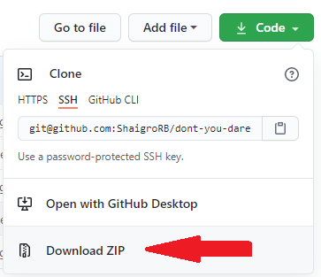
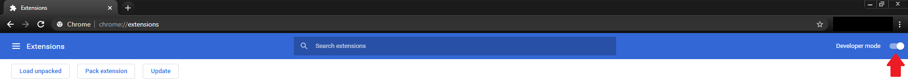
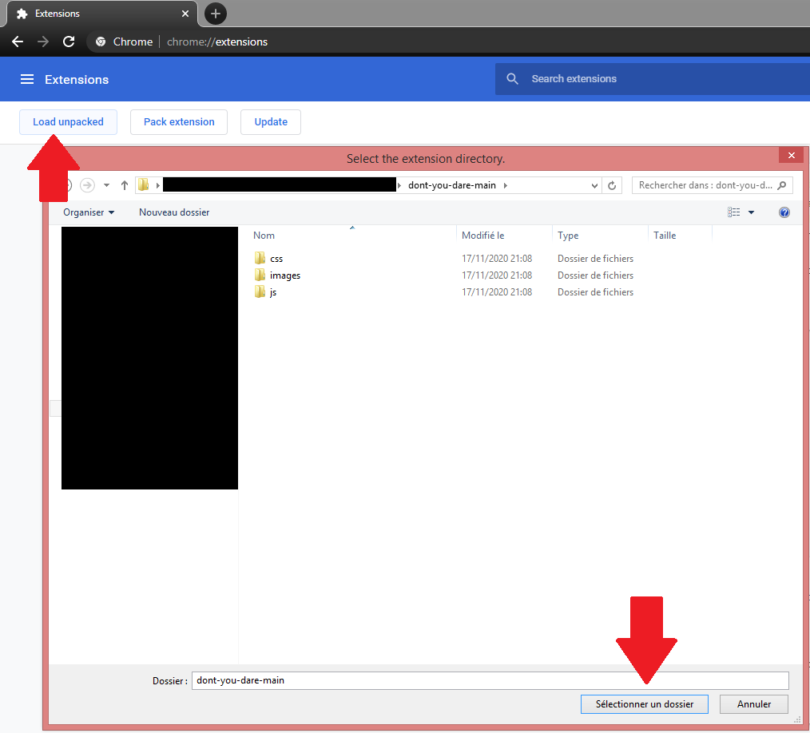
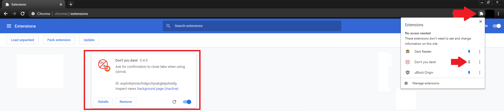
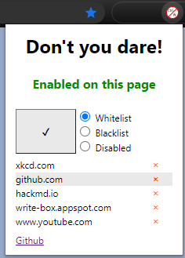
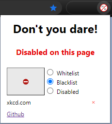

# Don't you dare!
This is a simple chrome extension that asks for confirmation to close tabs when you use Ctrl+W.

## Why?
Because I use a QWERTY keyboard and I'm french. Meaning that I inevitably need to write in french from sometimes.  
So I switch to an AZERTY layout. And write my stuff. And make a mistake. And do what would be a Ctrl+Z on a QWERTY but is a Ctrl+W on an AZERTY. And close my tab. And I get mad.  
That's why.

## Features
- Chrome extension
- Whitelist support
- Blacklist support

## How to install it
1. Download the ZIP:  
    
2. Extract it in your favorite location. You should end up with a folder called `dont-you-dare-main`
3. In chrome, go to the url `chrome://extension` and toggle the developer mode:  
   
4. Click on `Load unpacked` and navigate to the `dont-you-dare-main` folder. Select it:
   
5. And there you go! You can pin it by clicking opening the extensions and clicking the pin icon:  
   

## How to use it

- Click ⛔ to add the current website to the enabled list
- Click ✔️ to remove the current website from the enabled list
- Click on ❌ next to an url to remove it from the list
- Choose the preferred list:
  - Whitelist: The extension will apply only on the websites in the list.
  - Blacklist: The extension will apply on every website except for those in the list.
  - Disabled: Disable the extension.